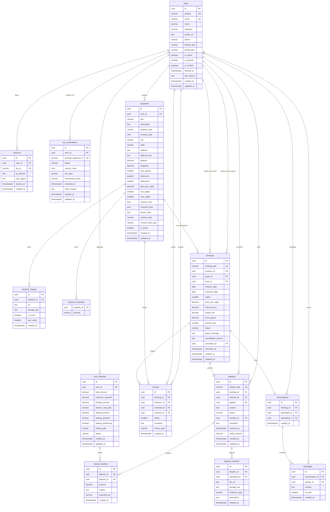

# Stayke — Esquema de Base de Datos

## DEBO MODIFICARLO Y ESTUDIAR LA ESTRUCTURA MAS APROPIADA

---

## Notas del esquema

### Separación on-chain / off-chain

Las columnas `*_pda` son **referencias**, no réplicas. El backend no duplica lógica del contrato — solo guarda la dirección del account on-chain para poder consultarlo cuando lo necesite.

| Tabla | PDA referenciada |
|---|---|
| `users` | `identity_pda`, `profile_pda`, `reputation_pda` |
| `user_deposits` | `kamino_vault_pda`, `staking_pda` |
| `bookings` | `booking_pda`, `escrow_pda` |
| `disputes` | `dispute_pda` |
| `properties` | `content_hash_pda` |

### Depósito inicial vs escrow de reserva

Son fondos completamente separados. `user_deposits` maneja el bond de comportamiento permanente del usuario. El `escrow_pda` en `bookings` es específico de cada transacción y no se mezcla con el depósito.

### Autenticación

`auth_nonces` tiene TTL corto (5-15 min) y los registros se eliminan al usarse (nonce de uso único). `sessions` es opcional si se usa JWT stateless — solo necesario si se requiere revocación de sesiones.
